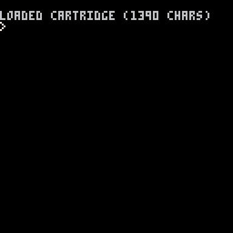
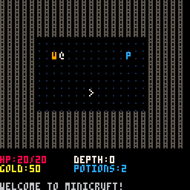

# PICO-8 + Claude Code

Testing Claude Code's ability to create PICO-8 games. Since PICO-8 project files are stored as plaintext, I wanted to see how well Claude Code could handle game development tasks.

## Test 1: Bouncing Ball
Simple animation test to verify Claude Code understood PICO-8's structure.

## Test 2: Walking Player  
Player controller with walking animation. Took some debugging but eventually worked.

## Test 3: Roguelike PoC
After adding context via CLAUDE.md, Claude Code created a dungeon crawler inspired by Angband.

## Takeaway
While the gamedev community has valid concerns about AI art, from a software perspective Claude Code could handle the grunt work during game jams - animation scripts, collision detection, menus, etc. Time constraints are real in jams, and this could help.